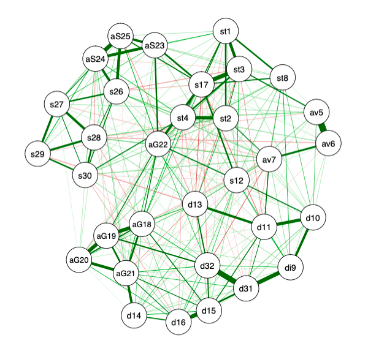

# Psychological networks to evaluate mental health during the Covid-19 lockdown in Mexico.  

This repo has all the code and documentation related to the study of Psychological networks to evaluate mental health during the Covid-19 lockdown in Mexico.  

The general **objective** of the project is to evaluate mental clinical conditions such as stress, anxiety and depression with psychological networks. The used data in this project comes from a Screening study conducted for the detection of Mental Health risks linked to COVID-19.

The most recent update in this project is in the following document: [report](https://github.com/ElenaVillano/mental_networks/blob/main/documentation/reporte.pdf).

### Repo description

- Code to run the analysis is in `Rcode/`.
- Reports are in `documentation/`.
- The main used articles are in `references/`.

---

Just a little example of one psychological network: 

:)
